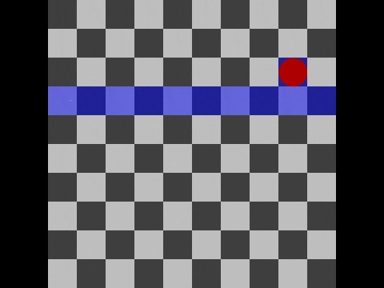

## RoboMop
RoboMop is a [JALSE](https://github.com/Ellzord/JALSE) example project. The mop cleans the floor tile it is current on and then moves in a consistent direction until it meets an edge. Once the mop has met an edge it will randomly change direction. This will repeat until the floor is eventually clean.

### Building and running with Gradle
1. Build using ```./gradlew build``` (see [Building Java Projects with Gradle](https://spring.io/guides/gs/gradle/#_build_your_project_with_gradle_wrapper))
2. Run using ```./gradle run``` (See [The Application Plugin](http://gradle.org/docs/current/userguide/application_plugin.html))

Optionally you can also create an **Eclipse** project using ```./gradlew eclipse``` (see [The Eclipse Plugins](http://gradle.org/docs/current/userguide/eclipse_plugin.html)).

### Screen capture


### More
See the [Wiki](https://github.com/Ellzord/JALSE/wiki) for more information.
